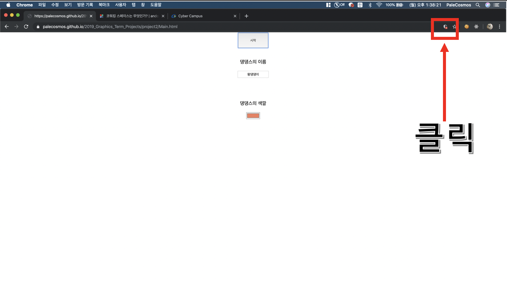
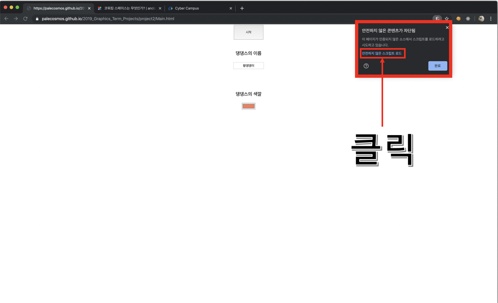
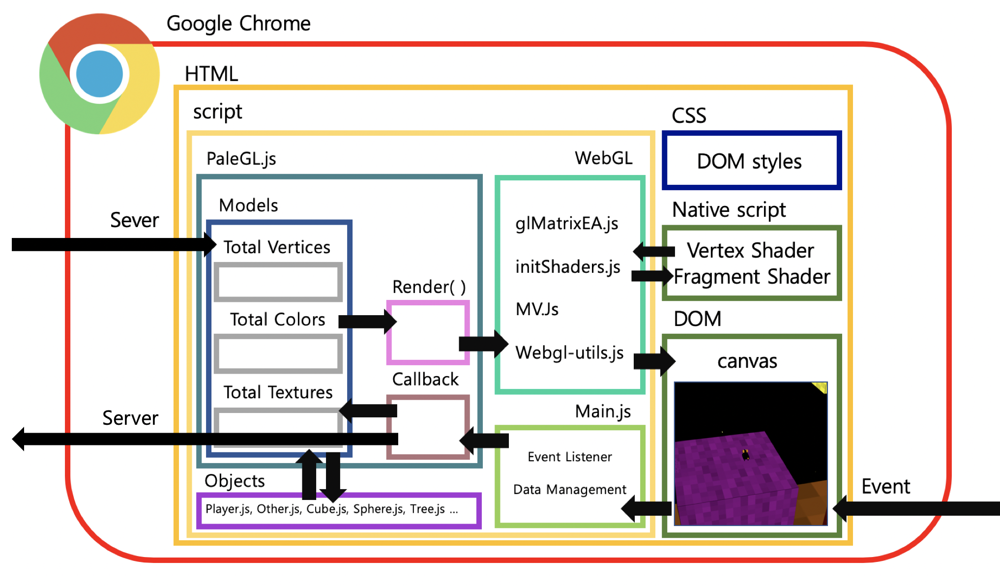
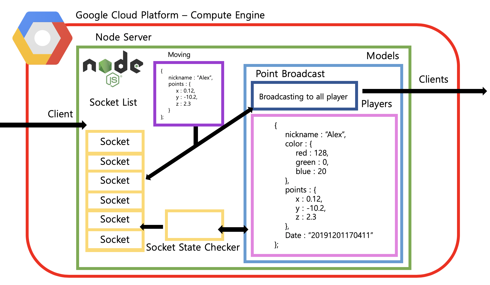
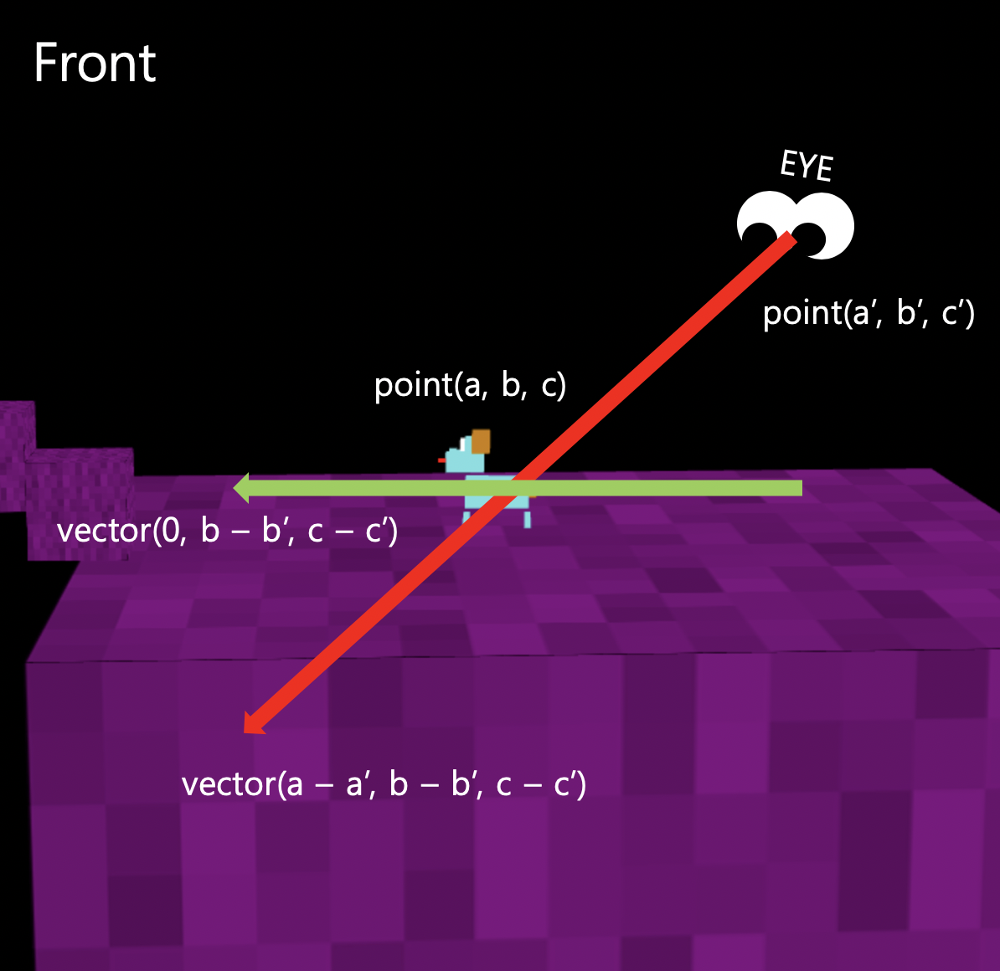
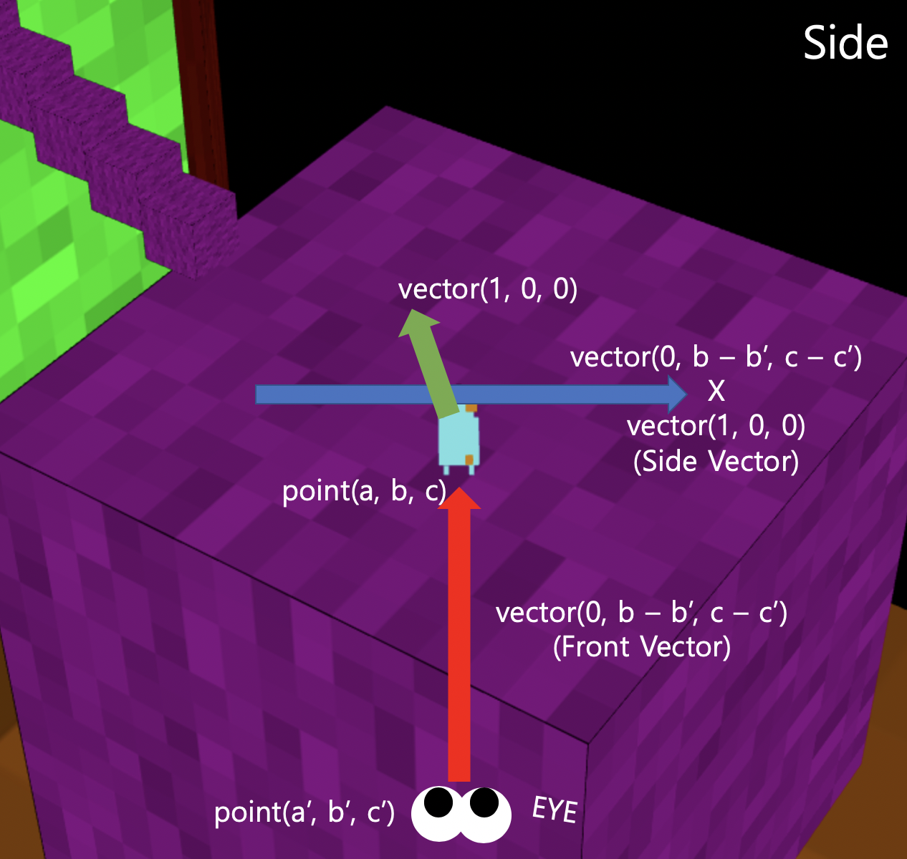
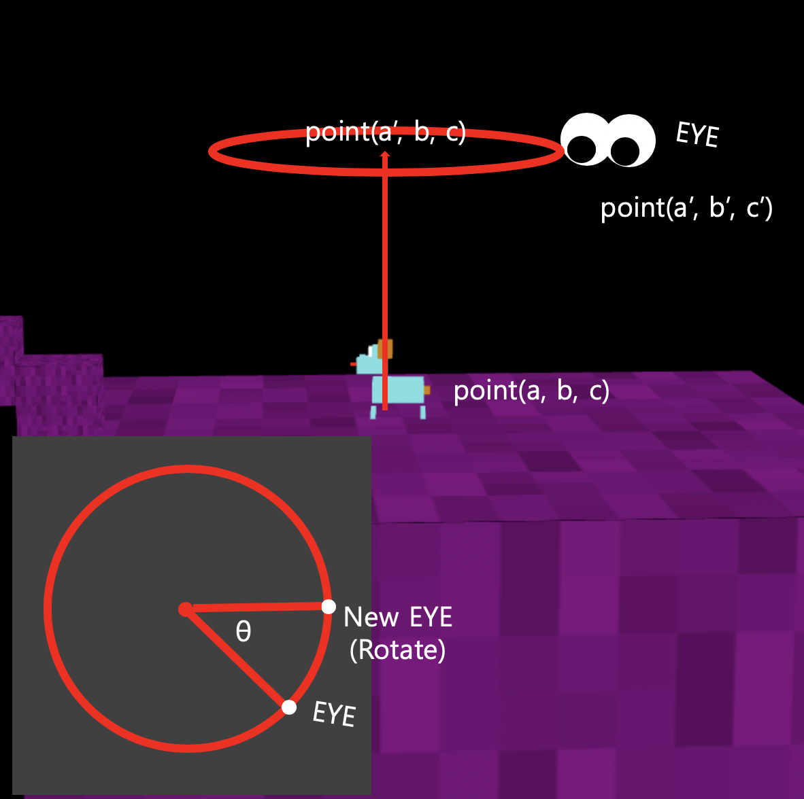
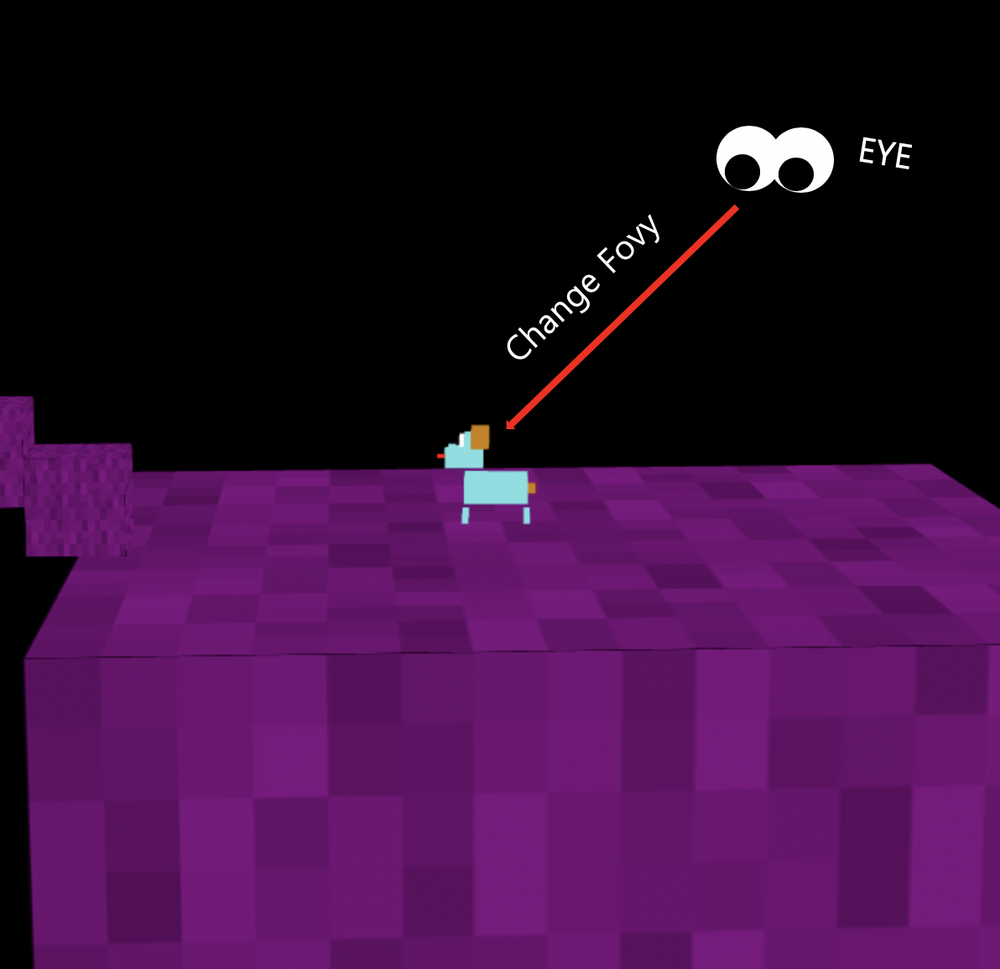
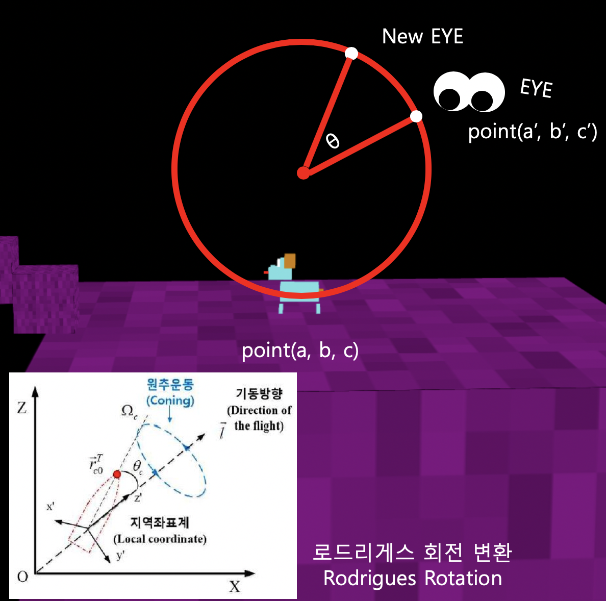

# 2019년 2학기 그래픽스 Term Project #2
<pre><a href="https://palecosmos.github.io/2019_Graphics_Term_Projects/project2/Main.html">https://palecosmos.github.io/2019_Graphics_Term_Projects/project2/Main.html</a></pre>

<p align="center">


</p>

### 즐기는 방법
```
이 게임은 Google Chrome에서만 구동됩니다.
URL 접속 후, 안전하지 않은 javascript를 허용해주세요.
```
<p align="center">


</p>

## Requirements

### About Project
```
'메이플스토리'의 인내의 숲을 모티브로하여 제작된 "네모네모 댕댕이들의 대탐험" 입니다.
[w, a, s, d] 키로 댕댕이를 조작하며 [space] 키로 점프가 가능합니다. (이단 점프까지 가능)
방향키로 시점을 조절할 수 있으며, [o, k] 키로 시점 높이 조절이 가능합니다.
또한 [shift] 키를 누르면 네모네모 댕댕이가 개소리를 냅니다.

각각의 맵에 존재하는 노랑치즈를 먹으면 사후 해당 맵에서 리스폰되며 BGM이 바뀝니다.
친구들과 모험을 즐겨보세요.
```

### Project Architecture
#### Client
<p align="center">

</p>

#### Server
<p align="center">

</p>

### Used Algorithm
#### Object Moving Event (w, s)
<p align="center">

</p>

#### Object Moving Event (a, d)
<p align="center">

</p>

#### Camera Moving Event (←, →)
<p align="center">

</p>

#### Camera Moving Event (↑, ↓)
<p align="center">

</p>

#### Camera Height Control (o, k)
<p align="center">

</p>

### Used Open Source
```
응없어
```

# LICENSE
```
   Copyright 2019 PaleCosmos

   Licensed under the Apache License, Version 2.0 (the "License");
   you may not use this file except in compliance with the License.
   You may obtain a copy of the License at

       http://www.apache.org/licenses/LICENSE-2.0

   Unless required by applicable law or agreed to in writing, software
   distributed under the License is distributed on an "AS IS" BASIS,
   WITHOUT WARRANTIES OR CONDITIONS OF ANY KIND, either express or implied.
   See the License for the specific language governing permissions and
   limitations under the License.
```
